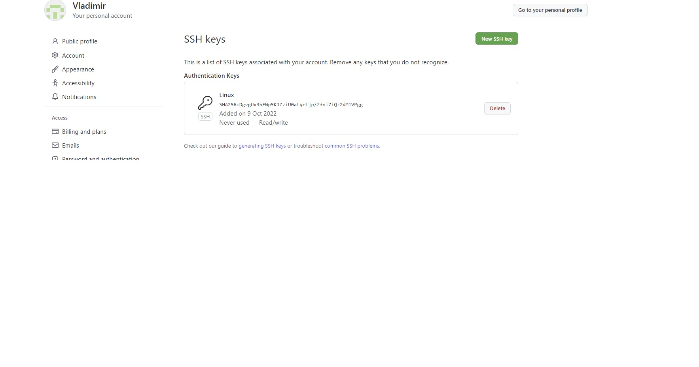
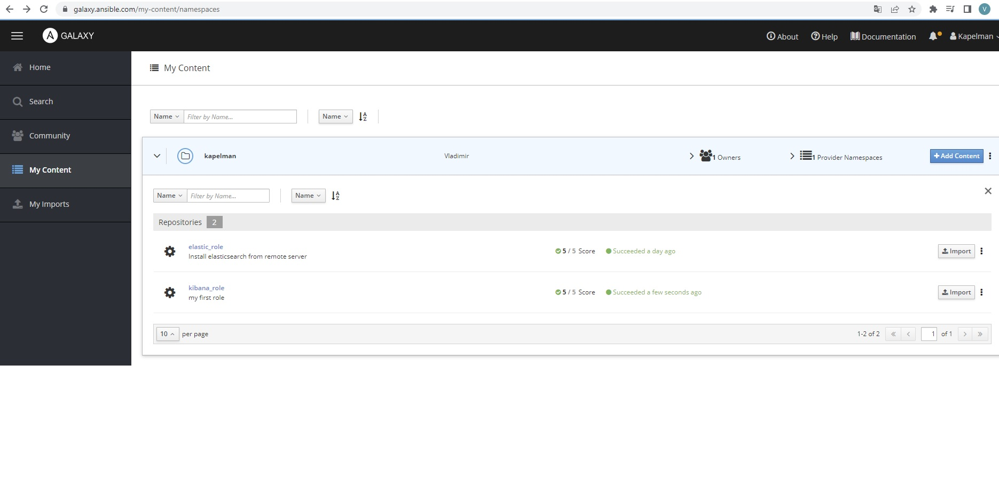

# Домашнее задание к занятию "08.03 Работа с Roles"

## Подготовка к выполнению
1. Создайте два пустых публичных репозитория в любом своём проекте: elastic-role и kibana-role.
Решение: 
- Создадим два репозитория: 
https://github.com/Kapelman/elastic-role
https://github.com/Kapelman/kibana-role
2. Скачайте [role](./roles/) из репозитория с домашним заданием и перенесите его в свой репозиторий elastic-role.
Решение:
 - Создадим репозитарий и перенесем в него elastic-role
```
PS C:\Users\kapli\homeworks\08-ansible-03-role\roles> git add *
PS C:\Users\kapli\homeworks\08-ansible-03-role\roles> git status
On branch master

No commits yet

Changes to be committed:
  (use "git rm --cached <file>..." to unstage)
        new file:   .gitignore
        new file:   README.md
        new file:   defaults/main.yml
        new file:   handlers/main.yml
        new file:   meta/main.yml
        new file:   molecule/default/converge.yml
        new file:   molecule/default/molecule.yml
        new file:   molecule/default/verify.yml
        new file:   tasks/main.yml
        new file:   templates/elk.sh.j2
        new file:   tests/inventory
        new file:   tests/test.yml
        new file:   vars/main.yml

PS C:\Users\kapli\homeworks\08-ansible-03-role\roles> git commit -m "Elastic role"
[master (root-commit) 29f091e] Elastic role
 13 files changed, 170 insertions(+)
 create mode 100644 .gitignore
 create mode 100644 README.md
 create mode 100644 defaults/main.yml
 create mode 100644 handlers/main.yml
 create mode 100644 meta/main.yml
 create mode 100644 molecule/default/converge.yml
 create mode 100644 molecule/default/molecule.yml
 create mode 100644 molecule/default/verify.yml
 create mode 100644 tasks/main.yml
 create mode 100644 templates/elk.sh.j2
 create mode 100644 tests/inventory
 create mode 100644 tests/test.yml
 create mode 100644 vars/main.yml
PS C:\Users\kapli\homeworks\08-ansible-03-role\roles> git branch -M main
PS C:\Users\kapli\homeworks\08-ansible-03-role\roles> git remote add origin https://github.com/Kapelman/elastic-role.git
PS C:\Users\kapli\homeworks\08-ansible-03-role\roles> git push -u origin main
Enumerating objects: 24, done.
Counting objects: 100% (24/24), done.
Delta compression using up to 16 threads
Compressing objects: 100% (13/13), done.
Writing objects: 100% (24/24), 3.37 KiB | 1.68 MiB/s, done.
Total 24 (delta 0), reused 0 (delta 0), pack-reused 0
To https://github.com/Kapelman/elastic-role.git
 * [new branch]      main -> main
branch 'main' set up to track 'origin/main'.
PS C:\Users\kapli\homeworks\08-ansible-03-role\roles>
```
[ссылка на репозиторий](https://github.com/Kapelman/elastic-role)

3. Скачайте дистрибутив [java](https://www.oracle.com/java/technologies/javase-jdk11-downloads.html) и положите его в директорию `playbook/files/`.
```
vagrant@vagrant:~/ansible-lesson0703/playbook/files$ ls -al
total 160996
drwxrwxr-x 2 vagrant vagrant      4096 Oct  9 20:04 .
drwxrwxr-x 3 vagrant vagrant      4096 Oct  9 20:02 ..
-rw-rw-r-- 1 vagrant vagrant 164845983 Oct  9 20:04 jdk-11.0.16.1_linux-aarch64_bin.tar.gz
```

5. Установите molecule: `pip3 install molecule`
```
$ sudo apt update
$ sudo apt install -y python3-pip libssl-dev
vagrant@vagrant:~/ansible-lesson0703/playbook/files$ python3 -m pip install molecule ansible-core
Successfully installed Jinja2-3.1.2 MarkupSafe-2.1.1 ansible-compat-2.2.1 ansible-core-2.13.4 arrow-1.2.3 binaryornot-0.4.4 cerberus-1.3.2 charset-normalizer-2.1.1 click-8.1.3 click-help-colors-0.9.1 commonmark-0.9.1 cookiecutter-2.1.1 enrich-1.2.7 importlib-resources-5.10.0 jinja2-time-0.2.0 jsonschema-4.16.0 molecule-4.0.1 packaging-21.3 pkgutil-resolve-name-1.3.10 pluggy-1.0.0 pygments-2.13.0 pyparsing-3.0.9 python-slugify-6.1.2 requests-2.28.1 resolvelib-0.8.1 rich-12.6.0 subprocess-tee-0.3.5 text-unidecode-1.3 typing-extensions-4.4.0 zipp-3.9.0

vagrant@vagrant:~/ansible-lesson0703/playbook/files$ python3 -m pip install --user "molecule"
Requirement already satisfied: molecule in /home/vagrant/.local/lib/python3.8/site-packages (4.0.1)
Requirement already satisfied: cerberus!=1.3.3,!=1.3.4,>=1.3.1 in /home/vagrant/.local/lib/python3.8/site-packages (from molecule) (1.3.2)
Requirement already satisfied: packaging in /home/vagrant/.local/lib/python3.8/site-packages (from molecule) (21.3)
Requirement already satisfied: pluggy<2.0,>=0.7.1 in /home/vagrant/.local/lib/python3.8/site-packages (from molecule) (1.0.0)
Requirement already satisfied: enrich>=1.2.7 in /home/vagrant/.local/lib/python3.8/site-packages (from molecule) (1.2.7)
Requirement already satisfied: cookiecutter>=1.7.3 in /home/vagrant/.local/lib/python3.8/site-packages (from molecule) (2.1.1)
Requirement already satisfied: click<9,>=8.0 in /home/vagrant/.local/lib/python3.8/site-packages (from molecule) (8.1.3)
Requirement already satisfied: PyYAML>=5.1 in /usr/lib/python3/dist-packages (from molecule) (5.3.1)
Requirement already satisfied: click-help-colors>=0.9 in /home/vagrant/.local/lib/python3.8/site-packages (from molecule) (0.9.1)
Requirement already satisfied: Jinja2>=2.11.3 in /home/vagrant/.local/lib/python3.8/site-packages (from molecule) (3.1.2)
Requirement already satisfied: ansible-compat>=2.2.0 in /home/vagrant/.local/lib/python3.8/site-packages (from molecule) (2.2.1)
Requirement already satisfied: rich>=9.5.1 in /home/vagrant/.local/lib/python3.8/site-packages (from molecule) (12.6.0)
Requirement already satisfied: setuptools in /usr/lib/python3/dist-packages (from cerberus!=1.3.3,!=1.3.4,>=1.3.1->molecule) (45.2.0)
Requirement already satisfied: pyparsing!=3.0.5,>=2.0.2 in /home/vagrant/.local/lib/python3.8/site-packages (from packaging->molecule) (3.0.9)
Requirement already satisfied: binaryornot>=0.4.4 in /home/vagrant/.local/lib/python3.8/site-packages (from cookiecutter>=1.7.3->molecule) (0.4.4)
Requirement already satisfied: requests>=2.23.0 in /home/vagrant/.local/lib/python3.8/site-packages (from cookiecutter>=1.7.3->molecule) (2.28.1)
Requirement already satisfied: python-slugify>=4.0.0 in /home/vagrant/.local/lib/python3.8/site-packages (from cookiecutter>=1.7.3->molecule) (6.1.2)
Requirement already satisfied: jinja2-time>=0.2.0 in /home/vagrant/.local/lib/python3.8/site-packages (from cookiecutter>=1.7.3->molecule) (0.2.0)
Requirement already satisfied: MarkupSafe>=2.0 in /home/vagrant/.local/lib/python3.8/site-packages (from Jinja2>=2.11.3->molecule) (2.1.1)
Requirement already satisfied: subprocess-tee>=0.3.5 in /home/vagrant/.local/lib/python3.8/site-packages (from ansible-compat>=2.2.0->molecule) (0.3.5)
Requirement already satisfied: jsonschema>=4.6.0 in /home/vagrant/.local/lib/python3.8/site-packages (from ansible-compat>=2.2.0->molecule) (4.16.0)
Requirement already satisfied: commonmark<0.10.0,>=0.9.0 in /home/vagrant/.local/lib/python3.8/site-packages (from rich>=9.5.1->molecule) (0.9.1)
Requirement already satisfied: pygments<3.0.0,>=2.6.0 in /home/vagrant/.local/lib/python3.8/site-packages (from rich>=9.5.1->molecule) (2.13.0)
Requirement already satisfied: typing-extensions<5.0,>=4.0.0; python_version < "3.9" in /home/vagrant/.local/lib/python3.8/site-packages (from rich>=9.5.1->molecule) (4.4.0)
Requirement already satisfied: chardet>=3.0.2 in /usr/lib/python3/dist-packages (from binaryornot>=0.4.4->cookiecutter>=1.7.3->molecule) (3.0.4)
Requirement already satisfied: certifi>=2017.4.17 in /usr/lib/python3/dist-packages (from requests>=2.23.0->cookiecutter>=1.7.3->molecule) (2019.11.28)
Requirement already satisfied: charset-normalizer<3,>=2 in /home/vagrant/.local/lib/python3.8/site-packages (from requests>=2.23.0->cookiecutter>=1.7.3->molecule) (2.1.1)
Requirement already satisfied: urllib3<1.27,>=1.21.1 in /usr/lib/python3/dist-packages (from requests>=2.23.0->cookiecutter>=1.7.3->molecule) (1.25.8)
Requirement already satisfied: idna<4,>=2.5 in /usr/lib/python3/dist-packages (from requests>=2.23.0->cookiecutter>=1.7.3->molecule) (2.8)
Requirement already satisfied: text-unidecode>=1.3 in /home/vagrant/.local/lib/python3.8/site-packages (from python-slugify>=4.0.0->cookiecutter>=1.7.3->molecule) (1.3)
Requirement already satisfied: arrow in /home/vagrant/.local/lib/python3.8/site-packages (from jinja2-time>=0.2.0->cookiecutter>=1.7.3->molecule) (1.2.3)
Requirement already satisfied: pyrsistent!=0.17.0,!=0.17.1,!=0.17.2,>=0.14.0 in /usr/lib/python3/dist-packages (from jsonschema>=4.6.0->ansible-compat>=2.2.0->molecule) (0.15.5)
Requirement already satisfied: importlib-resources>=1.4.0; python_version < "3.9" in /home/vagrant/.local/lib/python3.8/site-packages (from jsonschema>=4.6.0->ansible-compat>=2.2.0->molecule) (5.10.0)
Requirement already satisfied: attrs>=17.4.0 in /usr/lib/python3/dist-packages (from jsonschema>=4.6.0->ansible-compat>=2.2.0->molecule) (19.3.0)
Requirement already satisfied: pkgutil-resolve-name>=1.3.10; python_version < "3.9" in /home/vagrant/.local/lib/python3.8/site-packages (from jsonschema>=4.6.0->ansible-compat>=2.2.0->molecule) (1.3.10)
Requirement already satisfied: python-dateutil>=2.7.0 in /usr/lib/python3/dist-packages (from arrow->jinja2-time>=0.2.0->cookiecutter>=1.7.3->molecule) (2.7.3)
Requirement already satisfied: zipp>=3.1.0; python_version < "3.10" in /home/vagrant/.local/lib/python3.8/site-packages (from importlib-resources>=1.4.0; python_version < "3.9"->jsonschema>=4.6.0->ansible-compat>=2.2.0->molecule) (3.9.0)
```

6. Добавьте публичную часть своего ключа к своему профилю в github.



## Основная часть

Наша основная цель - разбить наш playbook на отдельные roles. Задача: сделать roles для elastic, kibana и написать playbook для использования этих ролей. Ожидаемый результат: существуют два ваших репозитория с roles и один репозиторий с playbook.

1. Создать в старой версии playbook файл `requirements.yml` и заполнить его следующим содержимым:
   ```yaml
   ---
     - src: git@github.com:netology-code/mnt-homeworks-ansible.git
       scm: git
       version: "1.0.1"
       name: java 
   ```
2. При помощи `ansible-galaxy` скачать себе эту роль. Запустите  `molecule test`, посмотрите на вывод команды.

Решение:
- установим роль:
```
vagrant@vagrant:~/ansible-lesson0703/playbook$ ansible-galaxy role install -r requirements.yml
Starting galaxy role install process
The authenticity of host 'github.com (140.82.121.3)' can't be established.
ECDSA key fingerprint is SHA256:p2QAMXNIC1TJYWeIOttrVc98/R1BUFWu3/LiyKgUfQM.
Are you sure you want to continue connecting (yes/no/[fingerprint])? yes
- extracting java to /home/vagrant/.ansible/roles/java
- java (1.0.1) was installed successfully
```

- протестируем, для этого переключимся на ROOT
Решение:

```
root@vagrant:/home/vagrant/.ansible/roles/java# molecule test
INFO     default scenario test matrix: dependency, lint, cleanup, destroy, syntax, create, prepare, converge, idempotence, side_effect, verify, cleanup, destroy
INFO     Performing prerun with role_name_check=0...
INFO     Set ANSIBLE_LIBRARY=/root/.cache/ansible-compat/38a096/modules:/root/.ansible/plugins/modules:/usr/share/ansible/plugins/modules
INFO     Set ANSIBLE_COLLECTIONS_PATH=/root/.cache/ansible-compat/38a096/collections:/root/.ansible/collections:/usr/share/ansible/collections
INFO     Set ANSIBLE_ROLES_PATH=/root/.cache/ansible-compat/38a096/roles:/root/.ansible/roles:/usr/share/ansible/roles:/etc/ansible/roles
INFO     Using /root/.cache/ansible-compat/38a096/roles/kaplin.java symlink to current repository in order to enable Ansible to find the role using its expected full name.
INFO     Running default > dependency
INFO     Running ansible-galaxy collection install -v community.docker:>=3.0.2
INFO     Running ansible-galaxy collection install -v ansible.posix:>=1.4.0
WARNING  Skipping, missing the requirements file.
WARNING  Skipping, missing the requirements file.
INFO     Running default > lint
INFO     Lint is disabled.
INFO     Running default > cleanup
WARNING  Skipping, cleanup playbook not configured.
INFO     Running default > destroy
INFO     Sanity checks: 'docker'

PLAY [Destroy] *****************************************************************

TASK [Set async_dir for HOME env] **********************************************
ok: [localhost]

TASK [Destroy molecule instance(s)] ********************************************
changed: [localhost] => (item=centos8)
changed: [localhost] => (item=centos7)
changed: [localhost] => (item=ubuntu)

TASK [Wait for instance(s) deletion to complete] *******************************
ok: [localhost] => (item=centos8)
ok: [localhost] => (item=centos7)
ok: [localhost] => (item=ubuntu)

TASK [Delete docker networks(s)] ***********************************************

PLAY RECAP *********************************************************************
localhost                  : ok=3    changed=1    unreachable=0    failed=0    skipped=1    rescued=0    ignored=0

INFO     Running default > syntax

playbook: /home/vagrant/.ansible/roles/java/molecule/default/converge.yml
INFO     Running default > create

PLAY [Create] ******************************************************************

TASK [Set async_dir for HOME env] **********************************************
ok: [localhost]

TASK [Log into a Docker registry] **********************************************
skipping: [localhost] => (item=None)
skipping: [localhost] => (item=None)
skipping: [localhost] => (item=None)
skipping: [localhost]

TASK [Check presence of custom Dockerfiles] ************************************
ok: [localhost] => (item={'image': 'docker.io/pycontribs/centos:8', 'name': 'centos8', 'pre_build_image': True})
ok: [localhost] => (item={'image': 'docker.io/pycontribs/centos:7', 'name': 'centos7', 'pre_build_image': True})
ok: [localhost] => (item={'image': 'docker.io/pycontribs/ubuntu:latest', 'name': 'ubuntu', 'pre_build_image': True})

TASK [Create Dockerfiles from image names] *************************************
skipping: [localhost] => (item={'image': 'docker.io/pycontribs/centos:8', 'name': 'centos8', 'pre_build_image': True})
skipping: [localhost] => (item={'image': 'docker.io/pycontribs/centos:7', 'name': 'centos7', 'pre_build_image': True})
skipping: [localhost] => (item={'image': 'docker.io/pycontribs/ubuntu:latest', 'name': 'ubuntu', 'pre_build_image': True})

TASK [Synchronization the context] *********************************************
skipping: [localhost] => (item={'image': 'docker.io/pycontribs/centos:8', 'name': 'centos8', 'pre_build_image': True})
skipping: [localhost] => (item={'image': 'docker.io/pycontribs/centos:7', 'name': 'centos7', 'pre_build_image': True})
skipping: [localhost] => (item={'image': 'docker.io/pycontribs/ubuntu:latest', 'name': 'ubuntu', 'pre_build_image': True})

TASK [Discover local Docker images] ********************************************
ok: [localhost] => (item={'changed': False, 'skipped': True, 'skip_reason': 'Conditional result was False', 'item': {'image': 'docker.io/pycontribs/centos:8', 'name': 'centos8', 'pre_build_image': True}, 'ansible_loop_var': 'item', 'i': 0, 'ansible_index_var': 'i'})
ok: [localhost] => (item={'changed': False, 'skipped': True, 'skip_reason': 'Conditional result was False', 'item': {'image': 'docker.io/pycontribs/centos:7', 'name': 'centos7', 'pre_build_image': True}, 'ansible_loop_var': 'item', 'i': 1, 'ansible_index_var': 'i'})
ok: [localhost] => (item={'changed': False, 'skipped': True, 'skip_reason': 'Conditional result was False', 'item': {'image': 'docker.io/pycontribs/ubuntu:latest', 'name': 'ubuntu', 'pre_build_image': True}, 'ansible_loop_var': 'item', 'i': 2, 'ansible_index_var': 'i'})

TASK [Build an Ansible compatible image (new)] *********************************
skipping: [localhost] => (item=molecule_local/docker.io/pycontribs/centos:8)
skipping: [localhost] => (item=molecule_local/docker.io/pycontribs/centos:7)
skipping: [localhost] => (item=molecule_local/docker.io/pycontribs/ubuntu:latest)

TASK [Create docker network(s)] ************************************************

TASK [Determine the CMD directives] ********************************************
ok: [localhost] => (item={'image': 'docker.io/pycontribs/centos:8', 'name': 'centos8', 'pre_build_image': True})
ok: [localhost] => (item={'image': 'docker.io/pycontribs/centos:7', 'name': 'centos7', 'pre_build_image': True})
ok: [localhost] => (item={'image': 'docker.io/pycontribs/ubuntu:latest', 'name': 'ubuntu', 'pre_build_image': True})

TASK [Create molecule instance(s)] *********************************************
changed: [localhost] => (item=centos8)
changed: [localhost] => (item=centos7)
changed: [localhost] => (item=ubuntu)

TASK [Wait for instance(s) creation to complete] *******************************
FAILED - RETRYING: [localhost]: Wait for instance(s) creation to complete (300 retries left).
```

3. Перейдите в каталог с ролью elastic-role и создайте сценарий тестирования по умолчанию при помощи `molecule init scenario --driver-name docker`.
Решение:
- скопируем роль из github репозитария
```
vagrant@vagrant:~/ansible-lesson0703/elastic-role$ git init
Initialized empty Git repository in /home/vagrant/ansible-lesson0703/elastic-role/.git/
vagrant@vagrant:~/ansible-lesson0703/elastic-role$ git clone https://github.com/Kapelman/elastic-role

- запустим molecule init scenario 
vagrant@vagrant:~/ansible-lesson0703/elastic-role/elastic-role$ molecule init scenario --driver-name docker scenario2
INFO     Initializing new scenario scenario2...
INFO     Initialized scenario in /home/vagrant/ansible-lesson0703/elastic-role/elastic-role/molecule/scenario2 successfully.
```

5. Добавьте несколько разных дистрибутивов (centos:8, ubuntu:latest) для инстансов и протестируйте роль, исправьте найденные ошибки, если они есть.
Решение:
- запустим тестирование
```
vagrant@vagrant:~/ansible-lesson0703/elastic-role/elastic-role$ molecule test -s scenario2
```
- после тестирования пришел вот к такому файлу task.yml
```
root@vagrant:/home/vagrant/ansible-lesson0703/elastic-role/elastic-role/tasks# cat main.yml
---
  - name: Upload .tar.gz Elastic file containing binaries from local storage
    copy:
      src: "/tmp/elasticsearch-{{ elastic_version }}-linux-x86_64.tar.gz"
      dest: "/tmp/elasticsearch-{{ elastic_version }}-linux-x86_64.tar.gz"
    register: get_elastic
    until: get_elastic is succeeded
    tags: elastic
  - name: Create directrory for Elasticsearch
    file:
      state: directory
      path: "{{ elastic_home }}"
    tags: elastic
  - name: Install SUDO
    package:
      name: sudo
    tags: elastic
  - name: Extract Elasticsearch in the installation directory
    become: true
    unarchive:
      copy: false
      src: "/tmp/elasticsearch-{{ elastic_version }}-linux-x86_64.tar.gz"
      dest: "{{ elastic_home }}"
      extra_opts: [--strip-components=1]
      creates: "{{ elastic_home }}/bin/elasticsearch"
    tags:
      - skip_ansible_lint
      - elastic
  - name: Set environment Elastic
    become: yes
    template:
      src: templates/elk.sh.j2
      dest: /etc/profile.d/elk.sh
    tags: elastic
```
- результаты тестирования сценария ниже 
```
root@vagrant:/home/vagrant/ansible-lesson0703/elastic-role/elastic-role# molecule test -s scenario2
INFO     scenario2 scenario test matrix: dependency, lint, cleanup, destroy, syntax, create, prepare, converge, idempotence, side_effect, verify, cleanup, destroy
INFO     Performing prerun with role_name_check=0...
INFO     Set ANSIBLE_LIBRARY=/root/.cache/ansible-compat/12e536/modules:/root/.ansible/plugins/modules:/usr/share/ansible/plugins/modules
INFO     Set ANSIBLE_COLLECTIONS_PATH=/root/.cache/ansible-compat/12e536/collections:/root/.ansible/collections:/usr/share/ansible/collections
INFO     Set ANSIBLE_ROLES_PATH=/root/.cache/ansible-compat/12e536/roles:/root/.ansible/roles:/usr/share/ansible/roles:/etc/ansible/roles
INFO     Using /root/.cache/ansible-compat/12e536/roles/kapelman.elastic_role symlink to current repository in order to enable Ansible to find the role using its expected full name.
INFO     Running scenario2 > dependency
WARNING  Skipping, missing the requirements file.
WARNING  Skipping, missing the requirements file.
INFO     Running scenario2 > lint
INFO     Lint is disabled.
INFO     Running scenario2 > cleanup
WARNING  Skipping, cleanup playbook not configured.
INFO     Running scenario2 > destroy
INFO     Sanity checks: 'docker'

PLAY [Destroy] *****************************************************************

TASK [Set async_dir for HOME env] **********************************************
ok: [localhost]

TASK [Destroy molecule instance(s)] ********************************************
changed: [localhost] => (item=centos8)
changed: [localhost] => (item=centos7)
changed: [localhost] => (item=ubuntu)

TASK [Wait for instance(s) deletion to complete] *******************************
ok: [localhost] => (item=centos8)
ok: [localhost] => (item=centos7)
ok: [localhost] => (item=ubuntu)

TASK [Delete docker networks(s)] ***********************************************

PLAY RECAP *********************************************************************
localhost                  : ok=3    changed=1    unreachable=0    failed=0    skipped=1    rescued=0    ignored=0

INFO     Running scenario2 > syntax

playbook: /home/vagrant/ansible-lesson0703/elastic-role/elastic-role/molecule/scenario2/converge.yml
INFO     Running scenario2 > create

PLAY [Create] ******************************************************************

TASK [Set async_dir for HOME env] **********************************************
ok: [localhost]

TASK [Log into a Docker registry] **********************************************
skipping: [localhost] => (item=None)
skipping: [localhost] => (item=None)
skipping: [localhost] => (item=None)
skipping: [localhost]

TASK [Check presence of custom Dockerfiles] ************************************
ok: [localhost] => (item={'image': 'quay.io/centos/centos:stream8', 'name': 'centos8', 'pre_build_image': True})
ok: [localhost] => (item={'image': 'docker.io/pycontribs/centos:7', 'name': 'centos7', 'pre_build_image': True})
ok: [localhost] => (item={'image': 'docker.io/pycontribs/ubuntu:latest', 'name': 'ubuntu', 'pre_build_image': True})

TASK [Create Dockerfiles from image names] *************************************
skipping: [localhost] => (item={'image': 'quay.io/centos/centos:stream8', 'name': 'centos8', 'pre_build_image': True})
skipping: [localhost] => (item={'image': 'docker.io/pycontribs/centos:7', 'name': 'centos7', 'pre_build_image': True})
skipping: [localhost] => (item={'image': 'docker.io/pycontribs/ubuntu:latest', 'name': 'ubuntu', 'pre_build_image': True})

TASK [Synchronization the context] *********************************************
skipping: [localhost] => (item={'image': 'quay.io/centos/centos:stream8', 'name': 'centos8', 'pre_build_image': True})
skipping: [localhost] => (item={'image': 'docker.io/pycontribs/centos:7', 'name': 'centos7', 'pre_build_image': True})
skipping: [localhost] => (item={'image': 'docker.io/pycontribs/ubuntu:latest', 'name': 'ubuntu', 'pre_build_image': True})

TASK [Discover local Docker images] ********************************************
ok: [localhost] => (item={'changed': False, 'skipped': True, 'skip_reason': 'Conditional result was False', 'item': {'image': 'quay.io/centos/centos:stream8', 'name': 'centos8', 'pre_build_image': True}, 'ansible_loop_var': 'item', 'i': 0, 'ansible_index_var': 'i'})
ok: [localhost] => (item={'changed': False, 'skipped': True, 'skip_reason': 'Conditional result was False', 'item': {'image': 'docker.io/pycontribs/centos:7', 'name': 'centos7', 'pre_build_image': True}, 'ansible_loop_var': 'item', 'i': 1, 'ansible_index_var': 'i'})
ok: [localhost] => (item={'changed': False, 'skipped': True, 'skip_reason': 'Conditional result was False', 'item': {'image': 'docker.io/pycontribs/ubuntu:latest', 'name': 'ubuntu', 'pre_build_image': True}, 'ansible_loop_var': 'item', 'i': 2, 'ansible_index_var': 'i'})

TASK [Build an Ansible compatible image (new)] *********************************
skipping: [localhost] => (item=molecule_local/quay.io/centos/centos:stream8)
skipping: [localhost] => (item=molecule_local/docker.io/pycontribs/centos:7)
skipping: [localhost] => (item=molecule_local/docker.io/pycontribs/ubuntu:latest)

TASK [Create docker network(s)] ************************************************

TASK [Determine the CMD directives] ********************************************
ok: [localhost] => (item={'image': 'quay.io/centos/centos:stream8', 'name': 'centos8', 'pre_build_image': True})
ok: [localhost] => (item={'image': 'docker.io/pycontribs/centos:7', 'name': 'centos7', 'pre_build_image': True})
ok: [localhost] => (item={'image': 'docker.io/pycontribs/ubuntu:latest', 'name': 'ubuntu', 'pre_build_image': True})

TASK [Create molecule instance(s)] *********************************************
changed: [localhost] => (item=centos8)
changed: [localhost] => (item=centos7)
changed: [localhost] => (item=ubuntu)

TASK [Wait for instance(s) creation to complete] *******************************
FAILED - RETRYING: [localhost]: Wait for instance(s) creation to complete (300 retries left).
changed: [localhost] => (item={'failed': 0, 'started': 1, 'finished': 0, 'ansible_job_id': '517605342385.64974', 'results_file': '/root/.ansible_async/517605342385.64974', 'changed': True, 'item': {'image': 'quay.io/centos/centos:stream8', 'name': 'centos8', 'pre_build_image': True}, 'ansible_loop_var': 'item'})
changed: [localhost] => (item={'failed': 0, 'started': 1, 'finished': 0, 'ansible_job_id': '745137505164.65002', 'results_file': '/root/.ansible_async/745137505164.65002', 'changed': True, 'item': {'image': 'docker.io/pycontribs/centos:7', 'name': 'centos7', 'pre_build_image': True}, 'ansible_loop_var': 'item'})
changed: [localhost] => (item={'failed': 0, 'started': 1, 'finished': 0, 'ansible_job_id': '236334075226.65036', 'results_file': '/root/.ansible_async/236334075226.65036', 'changed': True, 'item': {'image': 'docker.io/pycontribs/ubuntu:latest', 'name': 'ubuntu', 'pre_build_image': True}, 'ansible_loop_var': 'item'})

PLAY RECAP *********************************************************************
localhost                  : ok=6    changed=2    unreachable=0    failed=0    skipped=5    rescued=0    ignored=0

INFO     Running scenario2 > prepare
WARNING  Skipping, prepare playbook not configured.
INFO     Running scenario2 > converge

PLAY [Converge] ****************************************************************

TASK [Gathering Facts] *********************************************************
ok: [centos8]
ok: [ubuntu]
ok: [centos7]

TASK [Include elastic-role] ****************************************************

TASK [elastic-role : Upload .tar.gz Elastic file containing binaries from local storage] ***
changed: [centos7]
changed: [centos8]
changed: [ubuntu]

TASK [elastic-role : Create directrory for Elasticsearch] **********************
changed: [centos8]
changed: [ubuntu]
changed: [centos7]

TASK [elastic-role : Install SUDO] *********************************************
ok: [centos7]
ok: [ubuntu]
changed: [centos8]

TASK [elastic-role : Extract Elasticsearch in the installation directory] ******
changed: [centos8]
changed: [centos7]
changed: [ubuntu]

TASK [elastic-role : Set environment Elastic] **********************************
changed: [centos8]
changed: [ubuntu]
changed: [centos7]

PLAY RECAP *********************************************************************
centos7                    : ok=6    changed=4    unreachable=0    failed=0    skipped=0    rescued=0    ignored=0
centos8                    : ok=6    changed=5    unreachable=0    failed=0    skipped=0    rescued=0    ignored=0
ubuntu                     : ok=6    changed=4    unreachable=0    failed=0    skipped=0    rescued=0    ignored=0

INFO     Running scenario2 > idempotence

PLAY [Converge] ****************************************************************

TASK [Gathering Facts] *********************************************************
ok: [centos8]
ok: [ubuntu]
ok: [centos7]

TASK [Include elastic-role] ****************************************************

TASK [elastic-role : Upload .tar.gz Elastic file containing binaries from local storage] ***
ok: [centos8]
ok: [ubuntu]
ok: [centos7]

TASK [elastic-role : Create directrory for Elasticsearch] **********************
ok: [centos7]
ok: [ubuntu]
ok: [centos8]

TASK [elastic-role : Install SUDO] *********************************************
ok: [centos7]
ok: [centos8]
ok: [ubuntu]

TASK [elastic-role : Extract Elasticsearch in the installation directory] ******
skipping: [centos7]
skipping: [ubuntu]
skipping: [centos8]

TASK [elastic-role : Set environment Elastic] **********************************
ok: [centos7]
ok: [ubuntu]
ok: [centos8]

PLAY RECAP *********************************************************************
centos7                    : ok=5    changed=0    unreachable=0    failed=0    skipped=1    rescued=0    ignored=0
centos8                    : ok=5    changed=0    unreachable=0    failed=0    skipped=1    rescued=0    ignored=0
ubuntu                     : ok=5    changed=0    unreachable=0    failed=0    skipped=1    rescued=0    ignored=0

INFO     Idempotence completed successfully.
INFO     Running scenario2 > side_effect
WARNING  Skipping, side effect playbook not configured.
INFO     Running scenario2 > verify
INFO     Running Ansible Verifier

PLAY [Verify] ******************************************************************

TASK [Check Elastic version] ***************************************************
ok: [centos7]
ok: [centos8]
ok: [ubuntu]

PLAY RECAP *********************************************************************
centos7                    : ok=1    changed=0    unreachable=0    failed=0    skipped=0    rescued=0    ignored=0
centos8                    : ok=1    changed=0    unreachable=0    failed=0    skipped=0    rescued=0    ignored=0
ubuntu                     : ok=1    changed=0    unreachable=0    failed=0    skipped=0    rescued=0    ignored=0

INFO     Verifier completed successfully.
INFO     Running scenario2 > cleanup
WARNING  Skipping, cleanup playbook not configured.
INFO     Running scenario2 > destroy

PLAY [Destroy] *****************************************************************

TASK [Set async_dir for HOME env] **********************************************
ok: [localhost]

TASK [Destroy molecule instance(s)] ********************************************
changed: [localhost] => (item=centos8)
changed: [localhost] => (item=centos7)
changed: [localhost] => (item=ubuntu)

TASK [Wait for instance(s) deletion to complete] *******************************
FAILED - RETRYING: [localhost]: Wait for instance(s) deletion to complete (300 retries left).
changed: [localhost] => (item=centos8)
changed: [localhost] => (item=centos7)
changed: [localhost] => (item=ubuntu)

TASK [Delete docker networks(s)] ***********************************************

PLAY RECAP *********************************************************************
localhost                  : ok=3    changed=2    unreachable=0    failed=0    skipped=1    rescued=0    ignored=0

INFO     Pruning extra files from scenario ephemeral directory
```
6. Создайте новый каталог с ролью при помощи `molecule init role --driver-name docker kibana-role`. Можете использовать другой драйвер, который более удобен вам.
```buildoutcfg
root@vagrant:/home/vagrant/ansible-lesson0703# molecule init role 'kapelman.kibana' --driver-name docker
INFO     Initializing new role kibana...
Using /etc/ansible/ansible.cfg as config file
- Role kibana was created successfully
localhost | CHANGED => {"backup": "","changed": true,"msg": "line added"}
INFO     Initialized role in /home/vagrant/ansible-lesson0703/kibana successfully.
root@vagrant:/home/vagrant/ansible-lesson0703# cd kibana/
root@vagrant:/home/vagrant/ansible-lesson0703/kibana# ls -al
total 56
drwxr-xr-x 11 root    root    4096 Oct 10 13:55 .
drwxrwxr-x  5 vagrant vagrant 4096 Oct 10 13:55 ..
drwxr-xr-x  2 root    root    4096 Oct 10 13:55 defaults
drwxr-xr-x  2 root    root    4096 Oct 10 13:55 files
drwxr-xr-x  2 root    root    4096 Oct 10 13:55 handlers
drwxr-xr-x  2 root    root    4096 Oct 10 13:55 meta
drwxr-xr-x  3 root    root    4096 Oct 10 13:55 molecule
-rw-r--r--  1 root    root    1328 Oct 10 13:55 README.md
drwxr-xr-x  2 root    root    4096 Oct 10 13:55 tasks
drwxr-xr-x  2 root    root    4096 Oct 10 13:55 templates
drwxr-xr-x  2 root    root    4096 Oct 10 13:55 tests
-rw-r--r--  1 root    root     539 Oct 10 13:55 .travis.yml
drwxr-xr-x  2 root    root    4096 Oct 10 13:55 vars
-rw-r--r--  1 root    root     598 Oct 10 13:55 .yamllint
```
7. На основе tasks из старого playbook заполните новую role. Разнесите переменные между `vars` и `default`. Проведите тестирование на разных дистрибитивах (centos:7, centos:8, ubuntu).
- новый файл task
```buildoutcfg
---
# tasks file for kibana
  - name: Upload .tar.gz Upload Kibana file containing binaries from local storage
    copy:
      src: "/tmp/kibana-{{ kibana_version }}-linux-x86_64.tar.gz"
      dest: "/tmp/kibana-{{ kibana_version }}-linux-x86_64.tar.gz"
    register: get_kibana
    until: get_kibana is succeeded
    tags: kibana
  - name: Create directrory for Kibana
    file:
      state: directory
      path: "{{ kibana_home }}"
    tags: kibana
  - name: Install SUDO
    package:
      name: sudo
    tags: elastic
  - name: Extract Kibana in the installation directory
    become: true
    unarchive:
      copy: false
      src: "/tmp/kibana-{{ kibana_version }}-linux-x86_64.tar.gz"
      dest: "{{ kibana_home }}"
      extra_opts: [--strip-components=1]
      creates: "{{ kibana_home }}/bin/kibana"
    tags: kibana
  - name: Set environment Kibana
    become: true
    template:
      src: templates/kibana.sh.j2
      dest: /etc/profile.d/kibana.sh
    tags: kibana.sh.j2
```
- его проверка molecule test
```buildoutcfg
root@vagrant:/home/vagrant/ansible-lesson0703/kibana# molecule test
INFO     default scenario test matrix: dependency, lint, cleanup, destroy, syntax, create, prepare, converge, idempotence, side_effect, verify, cleanup, destroy
INFO     Performing prerun with role_name_check=0...
INFO     Set ANSIBLE_LIBRARY=/root/.cache/ansible-compat/805c02/modules:/root/.ansible/plugins/modules:/usr/share/ansible/plugins/modules
INFO     Set ANSIBLE_COLLECTIONS_PATH=/root/.cache/ansible-compat/805c02/collections:/root/.ansible/collections:/usr/share/ansible/collections
INFO     Set ANSIBLE_ROLES_PATH=/root/.cache/ansible-compat/805c02/roles:/root/.ansible/roles:/usr/share/ansible/roles:/etc/ansible/roles
INFO     Using /root/.cache/ansible-compat/805c02/roles/kapelman.kibana symlink to current repository in order to enable Ansible to find the role using its expected full name.
INFO     Running default > dependency
WARNING  Skipping, missing the requirements file.
WARNING  Skipping, missing the requirements file.
INFO     Running default > lint
INFO     Lint is disabled.
INFO     Running default > cleanup
WARNING  Skipping, cleanup playbook not configured.
INFO     Running default > destroy
INFO     Sanity checks: 'docker'

PLAY [Destroy] *****************************************************************

TASK [Set async_dir for HOME env] **********************************************
ok: [localhost]

TASK [Destroy molecule instance(s)] ********************************************
changed: [localhost] => (item=instance)

TASK [Wait for instance(s) deletion to complete] *******************************
ok: [localhost] => (item=instance)

TASK [Delete docker networks(s)] ***********************************************

PLAY RECAP *********************************************************************
localhost                  : ok=3    changed=1    unreachable=0    failed=0    skipped=1    rescued=0    ignored=0

INFO     Running default > syntax

playbook: /home/vagrant/ansible-lesson0703/kibana/molecule/default/converge.yml
INFO     Running default > create

PLAY [Create] ******************************************************************

TASK [Set async_dir for HOME env] **********************************************
ok: [localhost]

TASK [Log into a Docker registry] **********************************************
skipping: [localhost] => (item=None)
skipping: [localhost]

TASK [Check presence of custom Dockerfiles] ************************************
ok: [localhost] => (item={'image': 'quay.io/centos/centos:stream8', 'name': 'instance', 'pre_build_image': True})

TASK [Create Dockerfiles from image names] *************************************
skipping: [localhost] => (item={'image': 'quay.io/centos/centos:stream8', 'name': 'instance', 'pre_build_image': True})

TASK [Synchronization the context] *********************************************
skipping: [localhost] => (item={'image': 'quay.io/centos/centos:stream8', 'name': 'instance', 'pre_build_image': True})

TASK [Discover local Docker images] ********************************************
ok: [localhost] => (item={'changed': False, 'skipped': True, 'skip_reason': 'Conditional result was False', 'item': {'image': 'quay.io/centos/centos:stream8', 'name': 'instance', 'pre_build_image': True}, 'ansible_loop_var': 'item', 'i': 0, 'ansible_index_var': 'i'})

TASK [Build an Ansible compatible image (new)] *********************************
skipping: [localhost] => (item=molecule_local/quay.io/centos/centos:stream8)

TASK [Create docker network(s)] ************************************************

TASK [Determine the CMD directives] ********************************************
ok: [localhost] => (item={'image': 'quay.io/centos/centos:stream8', 'name': 'instance', 'pre_build_image': True})

TASK [Create molecule instance(s)] *********************************************
changed: [localhost] => (item=instance)

TASK [Wait for instance(s) creation to complete] *******************************
FAILED - RETRYING: [localhost]: Wait for instance(s) creation to complete (300 retries left).
changed: [localhost] => (item={'failed': 0, 'started': 1, 'finished': 0, 'ansible_job_id': '893620707373.76790', 'results_file': '/root/.ansible_async/893620707373.76790', 'changed': True, 'item': {'image': 'quay.io/centos/centos:stream8', 'name': 'instance', 'pre_build_image': True}, 'ansible_loop_var': 'item'})

PLAY RECAP *********************************************************************
localhost                  : ok=6    changed=2    unreachable=0    failed=0    skipped=5    rescued=0    ignored=0

INFO     Running default > prepare
WARNING  Skipping, prepare playbook not configured.
INFO     Running default > converge

PLAY [Converge] ****************************************************************

TASK [Gathering Facts] *********************************************************
ok: [instance]

TASK [Include kapelman.kibana] *************************************************

TASK [kapelman.kibana : Upload .tar.gz Upload Kibana file containing binaries from local storage] ***
changed: [instance]

TASK [kapelman.kibana : Create directrory for Kibana] **************************
changed: [instance]

TASK [kapelman.kibana : Install SUDO] ******************************************
changed: [instance]

TASK [kapelman.kibana : Extract Kibana in the installation directory] **********
changed: [instance]

TASK [kapelman.kibana : Set environment Kibana] ********************************
changed: [instance]

PLAY RECAP *********************************************************************
instance                   : ok=6    changed=5    unreachable=0    failed=0    skipped=0    rescued=0    ignored=0

INFO     Running default > idempotence

PLAY [Converge] ****************************************************************

TASK [Gathering Facts] *********************************************************
ok: [instance]

TASK [Include kapelman.kibana] *************************************************

TASK [kapelman.kibana : Upload .tar.gz Upload Kibana file containing binaries from local storage] ***
ok: [instance]

TASK [kapelman.kibana : Create directrory for Kibana] **************************
ok: [instance]

TASK [kapelman.kibana : Install SUDO] ******************************************
ok: [instance]

TASK [kapelman.kibana : Extract Kibana in the installation directory] **********
skipping: [instance]

TASK [kapelman.kibana : Set environment Kibana] ********************************
ok: [instance]

PLAY RECAP *********************************************************************
instance                   : ok=5    changed=0    unreachable=0    failed=0    skipped=1    rescued=0    ignored=0

INFO     Idempotence completed successfully.
INFO     Running default > side_effect
WARNING  Skipping, side effect playbook not configured.
INFO     Running default > verify
INFO     Running Ansible Verifier

PLAY [Verify] ******************************************************************

TASK [Example assertion] *******************************************************
ok: [instance] => {
    "changed": false,
    "msg": "All assertions passed"
}

PLAY RECAP *********************************************************************
instance                   : ok=1    changed=0    unreachable=0    failed=0    skipped=0    rescued=0    ignored=0

INFO     Verifier completed successfully.
INFO     Running default > cleanup
WARNING  Skipping, cleanup playbook not configured.
INFO     Running default > destroy

PLAY [Destroy] *****************************************************************

TASK [Set async_dir for HOME env] **********************************************
ok: [localhost]

TASK [Destroy molecule instance(s)] ********************************************
changed: [localhost] => (item=instance)

TASK [Wait for instance(s) deletion to complete] *******************************
FAILED - RETRYING: [localhost]: Wait for instance(s) deletion to complete (300 retries left).
changed: [localhost] => (item=instance)

TASK [Delete docker networks(s)] ***********************************************

PLAY RECAP *********************************************************************
localhost                  : ok=3    changed=2    unreachable=0    failed=0    skipped=1    rescued=0    ignored=0

INFO     Pruning extra files from scenario ephemeral directory
```
- проверка на Centos7, Ubuntu
```buildoutcfg
root@vagrant:/home/vagrant/ansible-lesson0703/kibana# molecule test -s scenario2
INFO     scenario2 scenario test matrix: dependency, lint, cleanup, destroy, syntax, create, prepare, converge, idempotence, side_effect, verify, cleanup, destroy
INFO     Performing prerun with role_name_check=0...
INFO     Set ANSIBLE_LIBRARY=/root/.cache/ansible-compat/805c02/modules:/root/.ansible/plugins/modules:/usr/share/ansible/plugins/modules
INFO     Set ANSIBLE_COLLECTIONS_PATH=/root/.cache/ansible-compat/805c02/collections:/root/.ansible/collections:/usr/share/ansible/collections
INFO     Set ANSIBLE_ROLES_PATH=/root/.cache/ansible-compat/805c02/roles:/root/.ansible/roles:/usr/share/ansible/roles:/etc/ansible/roles
INFO     Using /root/.cache/ansible-compat/805c02/roles/kapelman.kibana symlink to current repository in order to enable Ansible to find the role using its expected full name.
INFO     Running scenario2 > dependency
WARNING  Skipping, missing the requirements file.
WARNING  Skipping, missing the requirements file.
INFO     Running scenario2 > lint
INFO     Lint is disabled.
INFO     Running scenario2 > cleanup
WARNING  Skipping, cleanup playbook not configured.
INFO     Running scenario2 > destroy
INFO     Sanity checks: 'docker'

PLAY [Destroy] *****************************************************************

TASK [Set async_dir for HOME env] **********************************************
ok: [localhost]

TASK [Destroy molecule instance(s)] ********************************************
changed: [localhost] => (item=centos8)
changed: [localhost] => (item=centos7)
changed: [localhost] => (item=ubuntu)

TASK [Wait for instance(s) deletion to complete] *******************************
ok: [localhost] => (item=centos8)
ok: [localhost] => (item=centos7)
ok: [localhost] => (item=ubuntu)

TASK [Delete docker networks(s)] ***********************************************

PLAY RECAP *********************************************************************
localhost                  : ok=3    changed=1    unreachable=0    failed=0    skipped=1    rescued=0    ignored=0

INFO     Running scenario2 > syntax

playbook: /home/vagrant/ansible-lesson0703/kibana/molecule/scenario2/converge.yml
INFO     Running scenario2 > create

PLAY [Create] ******************************************************************

TASK [Set async_dir for HOME env] **********************************************
ok: [localhost]

TASK [Log into a Docker registry] **********************************************
skipping: [localhost] => (item=None)
skipping: [localhost] => (item=None)
skipping: [localhost] => (item=None)
skipping: [localhost]

TASK [Check presence of custom Dockerfiles] ************************************
ok: [localhost] => (item={'image': 'quay.io/centos/centos:stream8', 'name': 'centos8', 'pre_build_image': True})
ok: [localhost] => (item={'image': 'docker.io/pycontribs/centos:7', 'name': 'centos7', 'pre_build_image': True})
ok: [localhost] => (item={'image': 'docker.io/pycontribs/ubuntu:latest', 'name': 'ubuntu', 'pre_build_image': True})

TASK [Create Dockerfiles from image names] *************************************
skipping: [localhost] => (item={'image': 'quay.io/centos/centos:stream8', 'name': 'centos8', 'pre_build_image': True})
skipping: [localhost] => (item={'image': 'docker.io/pycontribs/centos:7', 'name': 'centos7', 'pre_build_image': True})
skipping: [localhost] => (item={'image': 'docker.io/pycontribs/ubuntu:latest', 'name': 'ubuntu', 'pre_build_image': True})

TASK [Synchronization the context] *********************************************
skipping: [localhost] => (item={'image': 'quay.io/centos/centos:stream8', 'name': 'centos8', 'pre_build_image': True})
skipping: [localhost] => (item={'image': 'docker.io/pycontribs/centos:7', 'name': 'centos7', 'pre_build_image': True})
skipping: [localhost] => (item={'image': 'docker.io/pycontribs/ubuntu:latest', 'name': 'ubuntu', 'pre_build_image': True})

TASK [Discover local Docker images] ********************************************
ok: [localhost] => (item={'changed': False, 'skipped': True, 'skip_reason': 'Conditional result was False', 'item': {'image': 'quay.io/centos/centos:stream8', 'name': 'centos8', 'pre_build_image': True}, 'ansible_loop_var': 'item', 'i': 0, 'ansible_index_var': 'i'})
ok: [localhost] => (item={'changed': False, 'skipped': True, 'skip_reason': 'Conditional result was False', 'item': {'image': 'docker.io/pycontribs/centos:7', 'name': 'centos7', 'pre_build_image': True}, 'ansible_loop_var': 'item', 'i': 1, 'ansible_index_var': 'i'})
ok: [localhost] => (item={'changed': False, 'skipped': True, 'skip_reason': 'Conditional result was False', 'item': {'image': 'docker.io/pycontribs/ubuntu:latest', 'name': 'ubuntu', 'pre_build_image': True}, 'ansible_loop_var': 'item', 'i': 2, 'ansible_index_var': 'i'})

TASK [Build an Ansible compatible image (new)] *********************************
skipping: [localhost] => (item=molecule_local/quay.io/centos/centos:stream8)
skipping: [localhost] => (item=molecule_local/docker.io/pycontribs/centos:7)
skipping: [localhost] => (item=molecule_local/docker.io/pycontribs/ubuntu:latest)

TASK [Create docker network(s)] ************************************************

TASK [Determine the CMD directives] ********************************************
ok: [localhost] => (item={'image': 'quay.io/centos/centos:stream8', 'name': 'centos8', 'pre_build_image': True})
ok: [localhost] => (item={'image': 'docker.io/pycontribs/centos:7', 'name': 'centos7', 'pre_build_image': True})
ok: [localhost] => (item={'image': 'docker.io/pycontribs/ubuntu:latest', 'name': 'ubuntu', 'pre_build_image': True})

TASK [Create molecule instance(s)] *********************************************
changed: [localhost] => (item=centos8)
changed: [localhost] => (item=centos7)
changed: [localhost] => (item=ubuntu)

TASK [Wait for instance(s) creation to complete] *******************************
FAILED - RETRYING: [localhost]: Wait for instance(s) creation to complete (300 retries left).
changed: [localhost] => (item={'failed': 0, 'started': 1, 'finished': 0, 'ansible_job_id': '204466378317.80422', 'results_file': '/root/.ansible_async/204466378317.80422', 'changed': True, 'item': {'image': 'quay.io/centos/centos:stream8', 'name': 'centos8', 'pre_build_image': True}, 'ansible_loop_var': 'item'})
changed: [localhost] => (item={'failed': 0, 'started': 1, 'finished': 0, 'ansible_job_id': '899557052138.80450', 'results_file': '/root/.ansible_async/899557052138.80450', 'changed': True, 'item': {'image': 'docker.io/pycontribs/centos:7', 'name': 'centos7', 'pre_build_image': True}, 'ansible_loop_var': 'item'})
changed: [localhost] => (item={'failed': 0, 'started': 1, 'finished': 0, 'ansible_job_id': '424279228631.80484', 'results_file': '/root/.ansible_async/424279228631.80484', 'changed': True, 'item': {'image': 'docker.io/pycontribs/ubuntu:latest', 'name': 'ubuntu', 'pre_build_image': True}, 'ansible_loop_var': 'item'})

PLAY RECAP *********************************************************************
localhost                  : ok=6    changed=2    unreachable=0    failed=0    skipped=5    rescued=0    ignored=0

INFO     Running scenario2 > prepare
WARNING  Skipping, prepare playbook not configured.
INFO     Running scenario2 > converge

PLAY [Converge] ****************************************************************

TASK [Gathering Facts] *********************************************************
ok: [centos8]
ok: [ubuntu]
ok: [centos7]

TASK [Include kibana] **********************************************************

TASK [kibana : Upload .tar.gz Upload Kibana file containing binaries from local storage] ***
changed: [ubuntu]
changed: [centos7]
changed: [centos8]

TASK [kibana : Create directrory for Kibana] ***********************************
changed: [centos8]
changed: [centos7]
changed: [ubuntu]

TASK [kibana : Install SUDO] ***************************************************
ok: [centos7]
ok: [ubuntu]
changed: [centos8]

TASK [kibana : Extract Kibana in the installation directory] *******************
changed: [centos8]
changed: [ubuntu]
changed: [centos7]

TASK [kibana : Set environment Kibana] *****************************************
changed: [centos8]
changed: [ubuntu]
changed: [centos7]

PLAY RECAP *********************************************************************
centos7                    : ok=6    changed=4    unreachable=0    failed=0    skipped=0    rescued=0    ignored=0
centos8                    : ok=6    changed=5    unreachable=0    failed=0    skipped=0    rescued=0    ignored=0
ubuntu                     : ok=6    changed=4    unreachable=0    failed=0    skipped=0    rescued=0    ignored=0

INFO     Running scenario2 > idempotence

PLAY [Converge] ****************************************************************

TASK [Gathering Facts] *********************************************************
ok: [centos8]
ok: [ubuntu]
ok: [centos7]

TASK [Include kibana] **********************************************************

TASK [kibana : Upload .tar.gz Upload Kibana file containing binaries from local storage] ***
ok: [centos7]
ok: [ubuntu]
ok: [centos8]

TASK [kibana : Create directrory for Kibana] ***********************************
ok: [centos7]
ok: [ubuntu]
ok: [centos8]

TASK [kibana : Install SUDO] ***************************************************
ok: [centos7]
ok: [centos8]
ok: [ubuntu]

TASK [kibana : Extract Kibana in the installation directory] *******************
skipping: [centos8]
skipping: [ubuntu]
skipping: [centos7]

TASK [kibana : Set environment Kibana] *****************************************
ok: [centos7]
ok: [ubuntu]
ok: [centos8]

PLAY RECAP *********************************************************************
centos7                    : ok=5    changed=0    unreachable=0    failed=0    skipped=1    rescued=0    ignored=0
centos8                    : ok=5    changed=0    unreachable=0    failed=0    skipped=1    rescued=0    ignored=0
ubuntu                     : ok=5    changed=0    unreachable=0    failed=0    skipped=1    rescued=0    ignored=0

INFO     Idempotence completed successfully.
INFO     Running scenario2 > side_effect
WARNING  Skipping, side effect playbook not configured.
INFO     Running scenario2 > verify
INFO     Running Ansible Verifier

PLAY [Verify] ******************************************************************

TASK [Example assertion] *******************************************************
ok: [centos7] => {
    "changed": false,
    "msg": "All assertions passed"
}
ok: [centos8] => {
    "changed": false,
    "msg": "All assertions passed"
}
ok: [ubuntu] => {
    "changed": false,
    "msg": "All assertions passed"
}

PLAY RECAP *********************************************************************
centos7                    : ok=1    changed=0    unreachable=0    failed=0    skipped=0    rescued=0    ignored=0
centos8                    : ok=1    changed=0    unreachable=0    failed=0    skipped=0    rescued=0    ignored=0
ubuntu                     : ok=1    changed=0    unreachable=0    failed=0    skipped=0    rescued=0    ignored=0

INFO     Verifier completed successfully.
INFO     Running scenario2 > cleanup
WARNING  Skipping, cleanup playbook not configured.
INFO     Running scenario2 > destroy

PLAY [Destroy] *****************************************************************

TASK [Set async_dir for HOME env] **********************************************
ok: [localhost]

TASK [Destroy molecule instance(s)] ********************************************
changed: [localhost] => (item=centos8)
changed: [localhost] => (item=centos7)
changed: [localhost] => (item=ubuntu)

TASK [Wait for instance(s) deletion to complete] *******************************
FAILED - RETRYING: [localhost]: Wait for instance(s) deletion to complete (300 retries left).
changed: [localhost] => (item=centos8)
changed: [localhost] => (item=centos7)
changed: [localhost] => (item=ubuntu)

TASK [Delete docker networks(s)] ***********************************************

PLAY RECAP *********************************************************************
localhost                  : ok=3    changed=2    unreachable=0    failed=0    skipped=1    rescued=0    ignored=0

INFO     Pruning extra files from scenario ephemeral directory
```
8. Выложите все roles в репозитории. Проставьте тэги, используя семантическую нумерацию.
Решение:
- Роли выложены в репозитарий:
Elastic - https://github.com/Kapelman/elastic-role/tree/main
Kibana - https://github.com/Kapelman/kibana-role

Добавим роли и на galaxy.ansible



10. Добавьте roles в `requirements.yml` в playbook.
Решение:
```
vagrant@vagrant:~/ansible-lesson0703/playbook$ cat requirements.yml
- src: git@github.com:netology-code/mnt-homeworks-ansible.git
  scm: git
  version: "1.0.1"
  name: java
- src: git@github.com:Kapelman/elastic-role.git
  scm: git
  name: elastic_role
- src: git@github.com:Kapelman/kibana-role.git
  scm: git
  name: kibana_role
 ```
```
vagrant@vagrant:~/ansible-lesson0703/playbook$ ansible-galaxy role install -r requirements.yml
Starting galaxy role install process
- java (1.0.1) is already installed, skipping.
- extracting elastic_role to /home/vagrant/.ansible/roles/elastic_role
- elastic_role was installed successfully
- extracting kibana_role to /home/vagrant/.ansible/roles/kibana_role
- kibana_role was installed successfully
```
11. Переработайте playbook на использование roles.
Решение:
```
vagrant@vagrant:~/ansible-lesson0703/playbook$ cat playbook.yml
---
- hosts: all
  roles:
    - java
  hosts: elasticsearch
  roles:
    - elastic_role
  hosts: kibana
  roles:
    - kibana_role
```
12. Выложите playbook в репозиторий.
13. В ответ приведите ссылки на оба репозитория с roles и одну ссылку на репозиторий с playbook.

## Необязательная часть

1. Проделайте схожие манипуляции для создания роли logstash.
2. Создайте дополнительный набор tasks, который позволяет обновлять стек ELK.
3. В ролях добавьте тестирование в раздел `verify.yml`. Данный раздел должен проверять, что elastic запущен и возвращает успешный статус по API, web-интерфейс kibana отвечает без кодов ошибки, logstash через команду `logstash -e 'input { stdin { } } output { stdout {} }'`.
4. Убедитесь в работоспособности своего стека. Возможно, потребуется тестировать все роли одновременно.
5. Выложите свои roles в репозитории. В ответ приведите ссылки.

---

### Как оформить ДЗ?

Выполненное домашнее задание пришлите ссылкой на .md-файл в вашем репозитории.

---
